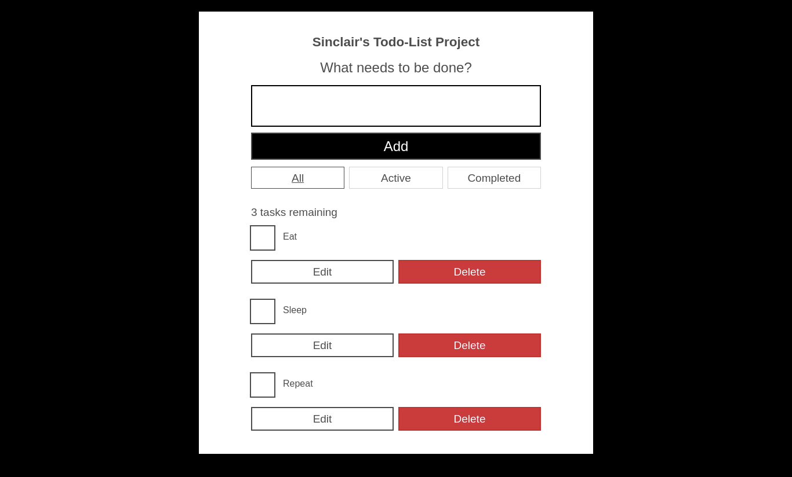

# Frontend Mentor - Easybank landing page solution

This is a solution to the [Easybank landing page challenge on Frontend Mentor](https://www.frontendmentor.io/challenges/easybank-landing-page-WaUhkoDN). Frontend Mentor challenges help you improve your coding skills by building realistic projects. 

## Table of contents

- [Overview](#overview)
  - [The challenge](#the-challenge)
  - [Screenshot](#screenshot)
  - [Links](#links)
- [My process](#my-process)
  - [Built with](#built-with)
  - [What I learned](#what-i-learned)
  - [Continued development](#continued-development)
  - [Useful resources](#useful-resources)
- [Author](#author)

## Overview

### The challenge

Users should be able to:

- Set a todo.
- Delete a todo.
- Edit the name of a Todo.
- Know the amount of todo left.

### Screenshot

(desktop image)

(Mobile image)

### Links

- Solution URL: [solution URL](https://github.com/sinclare210/TodoList-Project)
- Live Site URL: [live site URL](https://todo-list-project-mrzp.vercel.app/)

## My process

### Built with

- Jsx
- Tailwind CSS
- React

### What I learned

I learnt about usestate which is use to hold information, like a virtual storage, till the data is refreshed. I also learnt about props which is use to pass information from one component to another,

### Continued development

I would need o build more project with react to solidify my knowledge with usestate.

### Useful resources

- [Leant about React, usestate,useeffect](With the help of this resources: https://developer.mozilla.org/en-US/docs/Learn/Tools_and_testing/Client-side_JavaScript_frameworks/React_todo_list_beginning build a React TODO list) 

## Author

- Twitter - [@Sincla1Olajuwon](https://x.com/Sincla1Olajuwon?t=9Rl_pnqS5YlDRBy-PVlhWQ&s=09)

